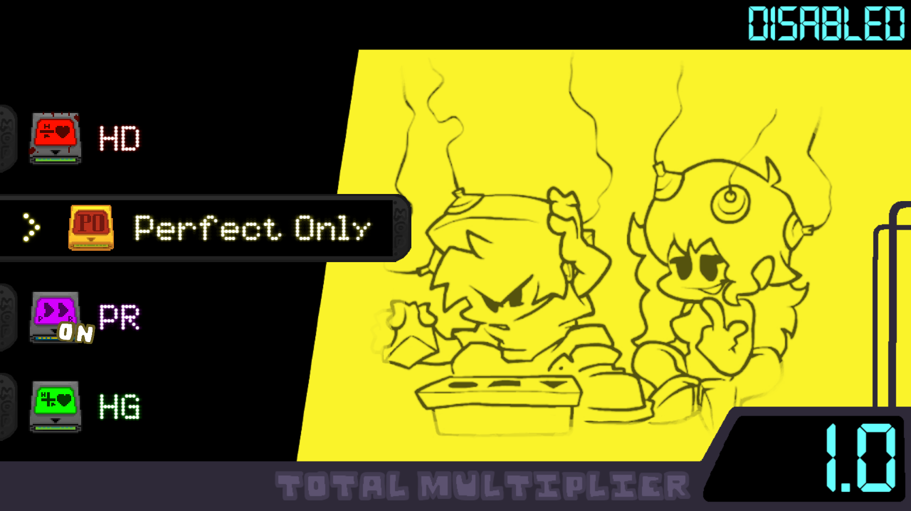

# Gammod

---
A mod for **Friday Night Funkin' V-Slice** that adds gameplay modifiers in a **data-driven**, expandable way. This repository is dedicated for saving my progress (lame) and hosting a **wiki** for you to make **your own addons for Gammod**, (mainly focusing on adressing probable compatibility issues and **how to add your own modifiers**).

---
I guess **opening issues** here is alright, it's definetly a better way than having them in the **Gamebanana** comments, (but hey, bug reports are well recieved in any way).
